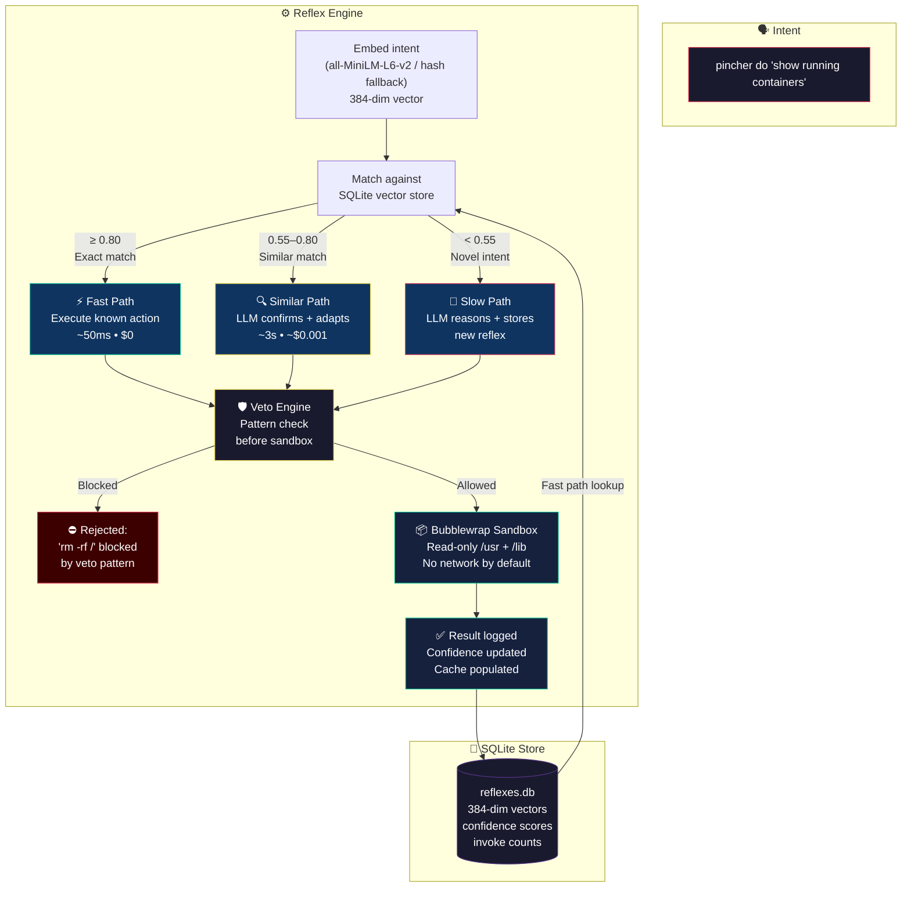
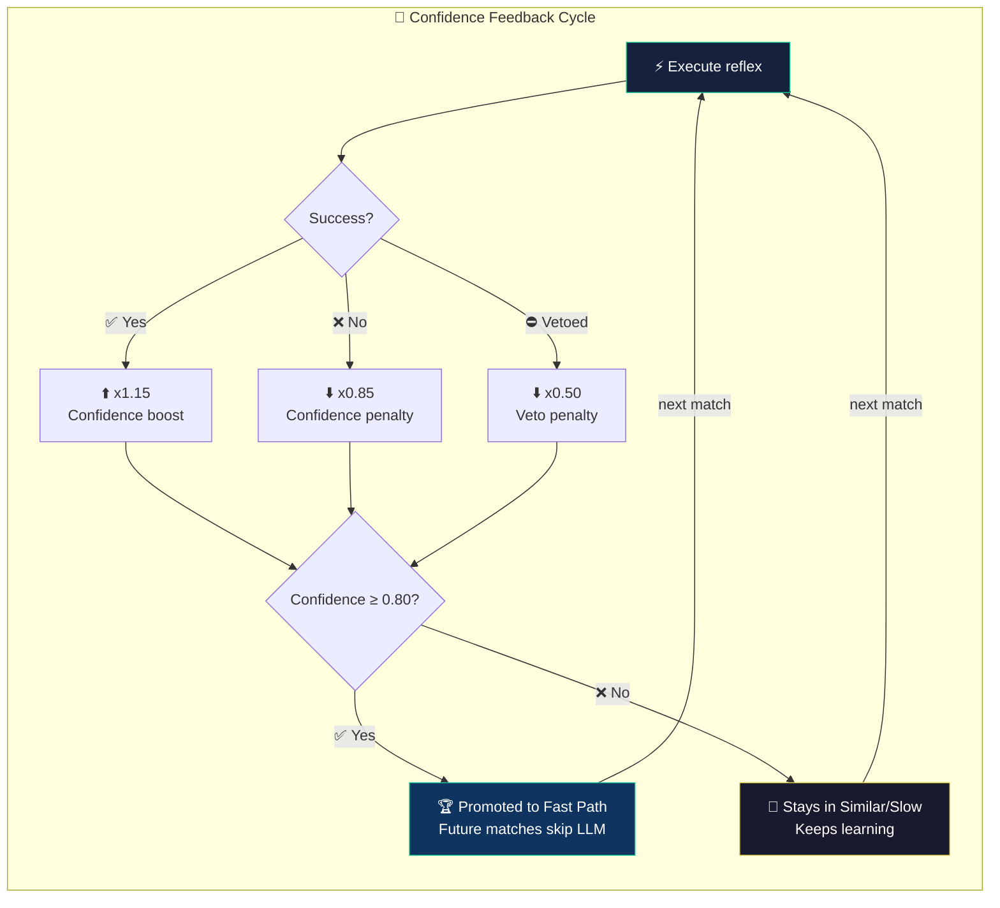
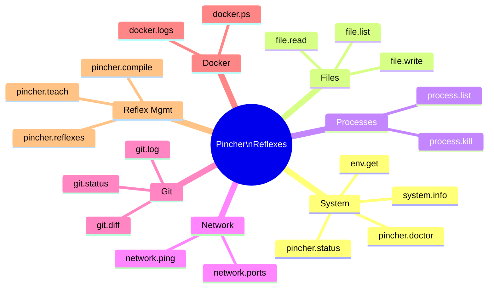
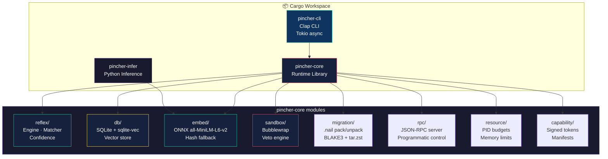
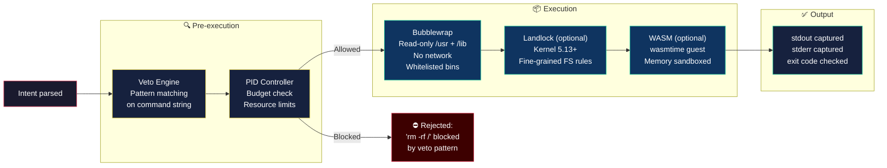
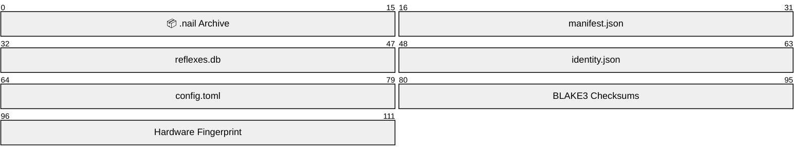
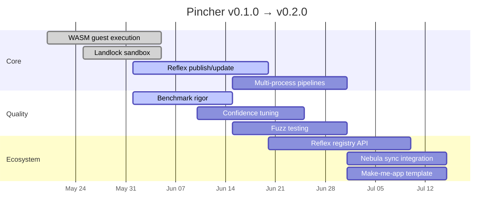
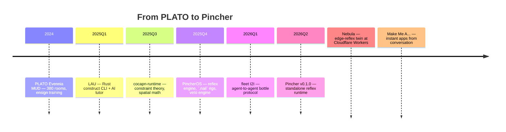

<p align="center">
  <picture>
    <source media="(prefers-color-scheme: dark)" srcset="assets/hermit-crab.jpg">
    
  </picture>
</p>

<h1 align="center">🦀 Pincher — Vector DB as Runtime, LLM as Compiler</h1>

<p align="center">
  <strong>A reflex runtime for agents.</strong> Teach once, match instantly, execute safely — every time faster.
</p>

<p align="center">
  <a href="#-the-reflex-engine"></a>
  <a href="./PLUG_AND_PLAY.md"></a>
  <a href="./GETTING_STARTED.md"></a>
  <a href="./ARCHITECTURE.md"></a>
  <a href="./LICENSE"></a>
  <a href="./install.sh"></a>
</p>

<br>

---

## The Elevator Pitch

**Pincher is the runtime that makes the "conversation is the building" pattern actually work.**

You say what you want. Pincher matches it against learned reflexes — sub-millisecond for known intents, ~3 seconds for novel ones that need LLM reasoning. Every interaction makes the system faster. No daemon. No cloud dependency. No configuration.

It snaps into any shell on any Linux machine and adds adaptive, battery-powered cognition — the same Teach → Match → Execute loop that powers Nebula at the edge, but running locally with SQLite, ONNX embeddings, and bubblewrap sandboxing.

---

## 🧠 The Reflex Engine



## 📈 The Confidence Loop

Every reflex has a confidence score. Every execution changes it:



**Three paths. One engine. No daemon needed.**

| Path | Confidence | Latency | Cost | When |
|------|-----------|---------|------|------|
| ⚡ **Fast** | ≥ 0.80 | ~50ms | $0 | Exact match — known reflex |
| 🔍 **Similar** | 0.55–0.80 | ~3s | ~$0.001 | Close match — LLM confirms + adapts |
| 🚀 **Slow** | < 0.55 | ~3-8s | ~$0.01 | Novel intent — full LLM reasoning + store |

> The system gets faster and more reliable the more you use it. Teach once, match instantly forever.

---

## 🎯 Built-in Reflexes

Every Pincher install ships with these ready to go:



---

## 🚀 Quick Start

```bash
# Install (checks for Rust, builds from source)
curl -fsSL https://raw.githubusercontent.com/SuperInstance/pincher/main/install.sh | bash

# Verify
pincher status
# → Engine: healthy · Reflexes: 12 · DB: ~/.pincher/reflexes.db

# Run a health check
pincher doctor
# → ONNX model: ✅ · SQLite: ✅ · Embedding: ✅ · Disk: 18G free

# Execute an intent
pincher do "list files in current directory"
# → [fast] matched 'file.list' at 0.92 confidence → executed in 47ms

# Teach a new reflex
pincher teach
# → Intent: show disk usage
# → Action: df -h /
# → Stored at confidence 0.55

# List all reflexes
pincher reflexes
# → 13 reflexes · avg confidence 0.67
```

---

## 🏗️ Under the Hood



**Three crates. One philosophy. Zero daemons.**

| Crate | Lines | Role |
|-------|-------|------|
| [`pincher-core`](./pincher-core/) | ~8K | All runtime logic — reflex engine, vector store, sandbox, migration, RPC |
| [`pincher-cli`](./pincher-cli/) | ~1.5K | Clap-based CLI — all subcommands wired to core |
| [`pincher-infer`](./pincher-infer/) | ~500 | Python inference module for ONNX embeddings |

---

## 🛡️ Safety First

Pincher runs untrusted intent in a **hardened sandbox**:



- **Bubblewrap** — read-only system directories, no network by default, whitelisted binaries
- **Veto Engine** — pattern-based blocking *before* execution (catches `rm -rf /`, fork bombs, etc.)
- **PID Controller** — resource budgets per reflex, OOM protection
- **Landlock** (optional) — kernel-level filesystem restrictions (5.13+)
- **WASM** (optional) — web assembly guest execution via wasmtime

---

## 📦 The Rig: Portable Agent Identity

Pack your entire agent into a **`.nail` file** — a portable archive with BLAKE3 integrity:



```bash
# Pack it up
pincher pack --output my-agent.nail

# Ship it
scp my-agent.nail user@server:~/

# Unpack anywhere
pincher unpack --bundle my-agent.nail

# Run against the new machine
pincher run --bundle my-agent.nail "show disk usage"
```

---

## 🧪 CLI Reference

```text
pincher ─── status ─────── Engine health, reflex count, DB path
     │     doctor ─────── Full health check (ONNX, SQLite, disk)
     │     teach ──────── Interactive reflex teaching
     │     do "..." ───── Execute intent through reflex engine
     │     reflexes ───── List reflexes + confidence scores
     │     compile ────── Workspace → WASM reflex
     │     mature ─────── Fuzzing for coverage expansion
     │     bench ──────── Latency benchmark suite
     │
     ├── pack ─────────── Pack → .nail file
     ├── unpack ───────── Unpack .nail ←─ file
     ├── run ──────────── Execute .nail bundle
     │
     ├── publish ──────── Publish to registry (stub)
     ├── update ───────── Check registry updates (stub)
     │
     ├── shell-info ───── Hardware fingerprint
     └── gastrolith ───── Checkpoint migration
```

---

## 🧭 What Pincher Is (and Isn't)

**Pincher is a focused, portable reflex runtime that works right now.** Here's the honest scope of v0.1.0:

<div align="center">

| ✅ Is | ❌ Isn't |
|-------|----------|
| CLI-driven reflex engine | Cloud fleet manager ("Lighthouse Keeper") |
| SQLite-backed vector store | Edge-sync protocol ("Tender") |
| Bubblewrap sandbox for safety | Docker image on Docker Hub |
| Teach → Match → Execute loop | Holodeck MUD or fantasy |
| `.nail` portable bundles | ESP32 or WebAssembly builds |
| Local, offline capable | Five deployment modes |
| ONNX + hash embeddings | Instant-boot guarantees |

</div>

> The project deploys in exactly **one mode**: build from source, run the binary. That's the honest scope of v0.1.0.

---

## 🗺️ Near-Term Roadmap



---

## 🧬 Lineage

Pincher is the descendant of a long line of agent infrastructure experiments:



Every shell fits. Every situation has the right shape. That's the hermit crab way.

---

## 🧪 Development

```bash
# Prerequisites: Rust toolchain
# (see rust-toolchain.toml for pinned version)

# Debug build
cargo build

# Release build (fast)
cargo build --release

# Full feature set
cargo build --release --features "onnx,landlock,wasmtime"

# Run all tests
cargo test --workspace
```

### Project Structure

```
/
├── Cargo.toml                 # Workspace root
├── rust-toolchain.toml        # Toolchain pinning
├── pincher-core/              # ~8K lines — all runtime logic
│   ├── src/reflex/            # Engine · Matcher · Confidence
│   ├── src/db/                # SQLite vector store (sqlite-vec)
│   ├── src/embed/             # ONNX all-MiniLM-L6-v2 + hash
│   ├── src/sandbox/           # Bubblewrap + Landlock + veto
│   ├── src/migration/         # .nail pack/unpack (tar.zst)
│   ├── src/rpc/               # JSON-RPC server
│   └── src/resource/          # PID budgets + memory limits
├── pincher-cli/               # ~1.5K lines — Clap CLI
├── pincher-infer/             # Python ONNX inference
├── tools/                     # Shell scripts (reflex-engine, fleet-scout, gc)
├── docs/                      # Architecture, roadmap, ADRs, checklists
├── assets/                    # Logo and hermit crab images
├── examples/                  # Code review, hello-reflex, smart-home
├── install.sh                 # One-line installer
└── .devcontainer/             # Codespace config
```

---

## 📚 Documentation

| Doc | What it covers |
|-----|---------------|
| [`PLUG_AND_PLAY.md`](./PLUG_AND_PLAY.md) | Quickest path from zero to running |
| [`GETTING_STARTED.md`](./GETTING_STARTED.md) | Detailed setup and first reflex |
| [`ARCHITECTURE.md`](./ARCHITECTURE.md) | Full system architecture and design decisions |
| [`API_REFERENCE.md`](./API_REFERENCE.md) | Complete CLI and library API reference |
| [`LOW_LEVEL.md`](./LOW_LEVEL.md) | Internal module walkthrough |
| [`docs/ROADMAP.md`](./docs/ROADMAP.md) | What's coming next |
| [`docs/FLEET_ARCHITECTURE.md`](./docs/FLEET_ARCHITECTURE.md) | How Pincher fits in the fleet |
| [`docs/COGNITIVE_REFLEXES.md`](./docs/COGNITIVE_REFLEXES.md) | Advanced reflex patterns |
| [`docs/PLATO-LINEAGE.md`](./docs/PLATO-LINEAGE.md) | The full history from PLATO to Pincher |

---

## 🤝 Contributing

PRs welcome. The project is in active development and the architecture is still settling. Good places to start:

- Add a built-in reflex dispatcher
- Improve veto pattern coverage
- Write benchmark harness tests
- Fix a `TODO` in the code

---

## 📜 License

**MIT OR Apache-2.0** — see `LICENSE`.

---

<p align="center">
  
</p>

<p align="center">
  <em>🦀 Same crab. Bigger shell.</em><br>
  <em>The hermit crab finds the right shell for every situation — but it starts with the one it's in.</em>
</p>
