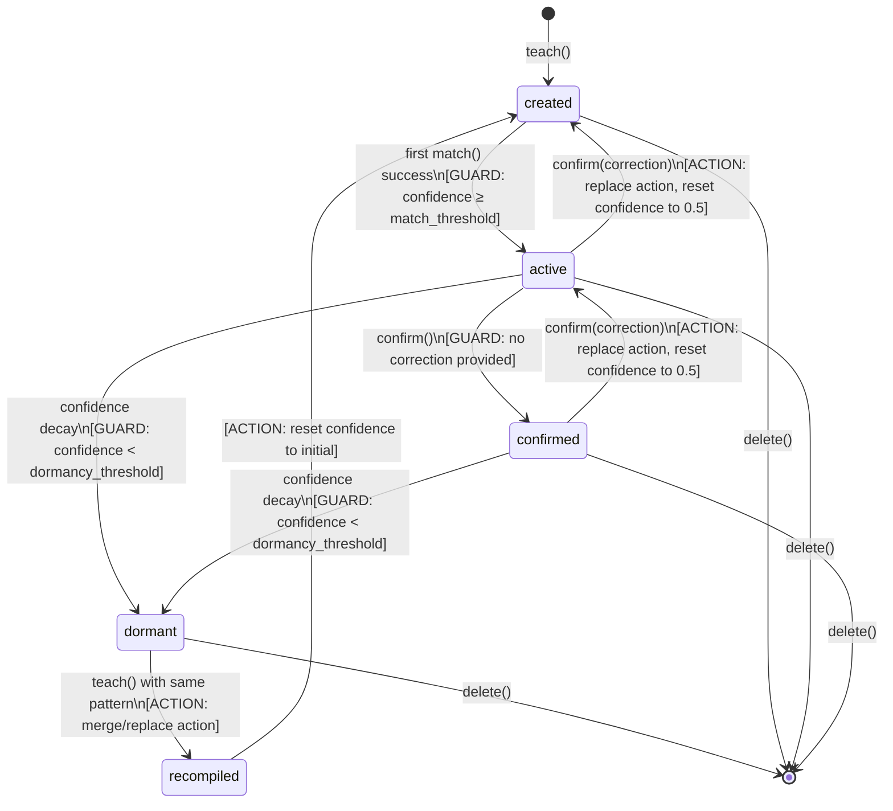
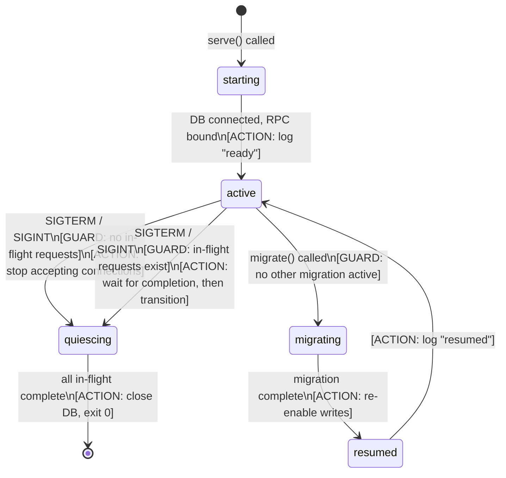
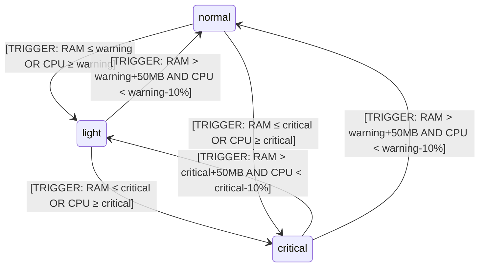
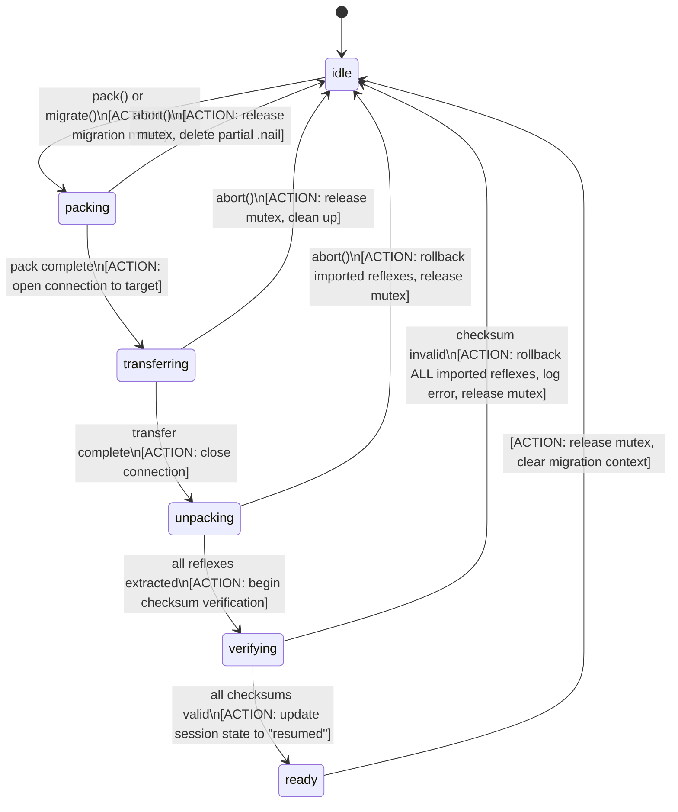

# PincherOS State Machine Reference

This document specifies all state machines in PincherOS. Each machine is defined with its states, transitions, triggers, guards, actions, and terminal conditions.

Cross-references: [INTEGRATION.md § State Model](./INTEGRATION.md#state-model) | [PROTOCOLS.md](./PROTOCOLS.md) | [CAPABILITIES.md](./CAPABILITIES.md)

---

## Reflex Lifecycle

### States

| State | Description | Executable? | Confidence Mutability |
|---|---|---|---|
| `created` | Reflex has been taught but not yet matched or confirmed. | No | Writable (initial value set at creation) |
| `active` | Reflex has been matched at least once and is eligible for execution. | Yes | Writable via confirm/decay |
| `confirmed` | Reflex has been explicitly confirmed by user or agent. Higher trust tier. | Yes | Writable via confirm/decay; decay rate is 0.5x of `active` |
| `dormant` | Reflex has decayed below `dormancy_threshold` (default: 0.15). Not executable. | No | Frozen; must be recompiled to change |
| `recompiled` | Reflex was dormant and has been updated with a new pattern or action. Transitions to `created`. | No | Writable |

### State Diagram



### Transition Table

| From | To | Trigger | Guard | Action |
|---|---|---|---|---|
| `created` | `active` | `match()` returns this reflex | `confidence ≥ match_threshold` (default: 0.3) | Set `matched_count += 1`, `last_matched_at = now()` |
| `created` | `active` | `confirm()` without correction | None | Set `confirmed_count += 1` |
| `active` | `confirmed` | `confirm()` without correction | None | Set `confirmed_count += 1`, state = `confirmed` |
| `active` | `created` | `confirm(correction)` | `correction != null` | Replace `action` with correction, set `confidence = 0.5`, set `state = created` |
| `confirmed` | `active` | `confirm(correction)` | `correction != null` | Replace `action` with correction, set `confidence = 0.5`, set `state = created` |
| `active` | `dormant` | Confidence decay (periodic) | `confidence < dormancy_threshold` | Set `state = dormant`, `dormant_since = now()` |
| `confirmed` | `dormant` | Confidence decay (periodic) | `confidence < dormancy_threshold` | Set `state = dormant`, `dormant_since = now()` |
| `dormant` | `recompiled` | `teach()` with matching pattern | Pattern matches dormant reflex's pattern within edit distance ≤ 2 | Merge or replace action |
| `recompiled` | `created` | Immediate | None | Reset confidence to `initial_confidence` (default: 0.5) |
| Any | *(deleted)* | `delete()` | None | Remove from database |

### Confidence Update Algorithm (Bayesian)

Confidence is updated using a Bayesian incremental approach:

```
Prior:    P(correct) = current_confidence
Evidence: observation = positive | negative

Positive observation (confirm without correction):
  P(correct | positive) = P(positive | correct) * P(correct) / P(positive)

  where:
    P(positive | correct) = 1.0
    P(positive | ~correct) = 0.1
    P(positive) = P(positive | correct) * P(correct) + P(positive | ~correct) * (1 - P(correct))

  Simplified update:
    new_confidence = confidence / (confidence + 0.1 * (1 - confidence))

Negative observation (confirm with correction or execution failure):
  P(correct | negative) = P(negative | correct) * P(correct) / P(negative)

  where:
    P(negative | correct) = 0.05
    P(negative | ~correct) = 0.9

  Simplified update:
    new_confidence = 0.05 * confidence / (0.05 * confidence + 0.9 * (1 - confidence))
```

**Decay**: Confidence decays exponentially over time if no observations are made.

```
confidence(t) = confidence(t₀) * e^(-λ * (t - t₀))

where:
  λ = 0.001 per hour for active reflexes
  λ = 0.0005 per hour for confirmed reflexes (half decay rate)
  t₀ = last observation time
```

**Constants**:

| Constant | Default | Config Key |
|---|---|---|
| `match_threshold` | 0.3 | `[reflex] match_threshold` |
| `dormancy_threshold` | 0.15 | `[reflex] dormancy_threshold` |
| `initial_confidence` | 0.5 | `[reflex] initial_confidence` |
| `decay_lambda_active` | 0.001 | `[reflex] decay_lambda_active` |
| `decay_lambda_confirmed` | 0.0005 | `[reflex] decay_lambda_confirmed` |

---

## Session States

### States

| State | Description | Accepts New Requests? | Allows In-Flight Completion? |
|---|---|---|---|
| `starting` | Server is initializing. DB connection not yet established. | No | N/A |
| `active` | Normal operation. All interfaces available. | Yes | Yes |
| `quiescing` | Graceful shutdown initiated. No new requests accepted. | No | Yes |
| `migrating` | A migration is in progress. Writes are blocked; reads allowed. | Read-only | Yes |
| `resumed` | Migration completed. Returning to normal operation. | Yes | Yes |

### State Diagram



### Transition Table

| From | To | Trigger | Guard | Action |
|---|---|---|---|---|
| `starting` | `active` | DB connection established, RPC socket bound | None | Log "PincherOS ready"; emit `pincher.status` with `session_state: "active"` |
| `active` | `quiescing` | SIGTERM, SIGINT, or `pincher.shutdown` RPC | None | Stop accepting new TCP connections; set request counter |
| `active` | `migrating` | `pincher.migrate` RPC or `pincher migrate` CLI | No concurrent migration | Block writes; set `migration_state` to `packing` |
| `migrating` | `resumed` | Migration state machine reaches `ready` | None | Re-enable writes |
| `resumed` | `active` | Immediate | None | Clear migration context |
| `quiescing` | *(terminated)* | In-flight request count reaches 0 | None | Close DB connection; exit process with code 0 |

### Session Checkpointing

Session state is checkpointed to SQLite every 60 seconds and on graceful shutdown. On crash recovery:

1. Read last checkpoint from `sessions` table.
2. Reconstruct `active` state.
3. Any in-flight requests at crash time are marked as `unknown` in audit log (not retried).

---

## Resource States

### States

| State | Description | Behavior |
|---|---|---|
| `normal` | Sufficient resources. All operations available. | No restrictions. |
| `light` | Resources approaching limits. Degraded mode. | Embedding generation skipped (use cached); confirmation decay accelerated 2x. |
| `critical` | Resources below minimum. Protective mode. | All `execute` and `teach` requests refused (error code 9). `match` still available (read-only). |

### State Diagram



### Transition Table

| From | To | Trigger | Guard | Action |
|---|---|---|---|---|
| `normal` | `light` | Resource sample (every 500ms) | `available_ram ≤ ram_warning_mb` OR `cpu_usage ≥ cpu_warning_pct` | Log warning; enable degraded mode |
| `light` | `normal` | Resource sample | `available_ram > ram_warning_mb + 50` AND `cpu_usage < cpu_warning_pct - 10` | Log recovery; disable degraded mode |
| `light` | `critical` | Resource sample | `available_ram ≤ ram_critical_mb` OR `cpu_usage ≥ cpu_critical_pct` | Log critical; enable protective mode |
| `critical` | `light` | Resource sample | `available_ram > ram_critical_mb + 50` AND `cpu_usage < cpu_critical_pct - 10` | Log partial recovery; keep degraded mode |
| `normal` | `critical` | Resource sample | `available_ram ≤ ram_critical_mb` OR `cpu_usage ≥ cpu_critical_pct` | Log critical; enable protective mode |
| `critical` | `normal` | Resource sample | `available_ram > ram_warning_mb + 50` AND `cpu_usage < cpu_warning_pct - 10` | Log full recovery; disable degraded mode |

### Default Thresholds

See [INTEGRATION.md § Configuration](./INTEGRATION.md#configuration) for config keys.

| Metric | Warning (→ light) | Critical (→ critical) |
|---|---|---|
| Available RAM | ≤ 512 MB | ≤ 256 MB |
| CPU usage | ≥ 80% | ≥ 95% |

### PID Controller State Transitions

PincherOS uses a PID controller to manage resource pressure and proactively adjust behavior before hitting hard thresholds.

**PID Controller Parameters**:

| Parameter | Default | Config Key |
|---|---|---|
| Kp (proportional gain) | 0.6 | `[pid] kp` |
| Ki (integral gain) | 0.1 | `[pid] ki` |
| Kd (derivative gain) | 0.3 | `[pid] kd` |
| Setpoint (target CPU%) | 60 | `[pid] setpoint` |
| Sample period | 500ms | `[resources] sample_interval_ms` |
| Integral windup limit | ±100 | `[pid] integral_limit` |

**PID Output → Action Mapping**:

| PID Output Range | Action |
|---|---|
| output < 0 | No intervention needed |
| 0 ≤ output < 0.3 | Log warning; reduce embedding cache TTL |
| 0.3 ≤ output < 0.7 | Enter `light` resource state behavior proactively |
| output ≥ 0.7 | Enter `critical` resource state behavior proactively |

**PID State Variables** (maintained in memory):

```json
{
  "previous_error": "float64",
  "integral": "float64",
  "last_sample_time": "uint64 (ms since epoch)",
  "output": "float64"
}
```

**PID Update Algorithm** (executed every sample period):

```
error = setpoint - current_cpu_pct
integral = clamp(integral + error * dt, -integral_limit, integral_limit)
derivative = (error - previous_error) / dt
output = Kp * error + Ki * integral + Kd * derivative
previous_error = error
```

---

## Migration States

### States

| State | Description | Reversible? |
|---|---|---|
| `idle` | No migration in progress. | N/A |
| `packing` | Collecting reflexes and building .nail file. | Yes (abort → `idle`) |
| `transferring` | Sending .nail file to target device. | Yes (abort → `idle`, partial file cleaned up) |
| `unpacking` | Extracting reflexes from .nail file on target. | Yes (abort → `idle`, partial imports rolled back) |
| `verifying` | Validating checksums and compatibility scores. | No (must complete) |
| `ready` | Migration complete. All reflexes imported. | N/A (transitions to `idle`) |

### State Diagram



### Transition Table

| From | To | Trigger | Guard | Action |
|---|---|---|---|---|
| `idle` | `packing` | `pack()` or `migrate()` called | No concurrent migration | Lock migration mutex; collect reflex IDs |
| `packing` | `transferring` | .nail file written successfully | Checksum computed | Open transfer channel to target |
| `packing` | `idle` | `abort()` or pack error | None | Delete partial .nail; release mutex |
| `transferring` | `unpacking` | All bytes sent and acknowledged | None | Close transfer channel |
| `transferring` | `idle` | `abort()` or transfer error | None | Clean up partial transfer; release mutex |
| `unpacking` | `verifying` | All reflexes extracted to staging | None | Begin per-reflex checksum verification |
| `unpacking` | `idle` | `abort()` | None | Rollback staged reflexes; release mutex |
| `verifying` | `ready` | All checksums valid | None | Commit staged reflexes; update session state |
| `verifying` | `idle` | Any checksum invalid | None | Rollback ALL staged reflexes; log error; release mutex |
| `ready` | `idle` | Immediate or on next status query | None | Release mutex; clear migration context |

### Migration Mutex

- Only one migration can be active at a time.
- Attempting a second migration while one is active returns error code 8 with message `"migration already in progress"`.
- Mutex is released on: completion, abort, or process crash (recovered via DB checkpoint).

---

## Embedding and Matching Algorithm

### Embedding Generation

**ONNX Backend** (preferred):
1. Tokenize input text using model's tokenizer.
2. Run inference through ONNX model.
3. Extract [CLS] token embedding or mean-pool last hidden state.
4. L2-normalize the resulting vector.
5. Output: `float64[384]`

**Hash Backend** (fallback):
1. Compute SipHash-2-4 of input text (seeded with reflex-specific salt).
2. Map hash to pseudo-random vector using PCG32 PRNG.
3. L2-normalize the resulting vector.
4. Output: `float64[128]`

**Dimensionality note**: ONNX and hash backends produce different dimension vectors. Cross-backend matching is not supported. If backend changes, all existing embeddings must be regenerated.

### Matching Algorithm

1. Embed the input text using the active backend.
2. Compute cosine similarity against all `active` and `confirmed` reflex embeddings.
3. Filter results by `threshold` (default: 0.3).
4. If multiple matches, return the highest similarity.
5. If no match exceeds threshold, return `matched: false`.

**Cosine similarity**:
```
sim(a, b) = (a · b) / (||a|| * ||b||)
```

Since embeddings are L2-normalized: `sim(a, b) = a · b`

**Matching latency target**: ≤ 50ms for ≤ 10,000 reflexes on commodity hardware.

### Embedding Cache

- Last 256 embeddings are cached in memory (LRU eviction).
- Cache key: hash of input text.
- Cache hit: returns embedding in <1ms.
- Cache is invalidated when backend changes or on `pincher.cache.clear` RPC.
